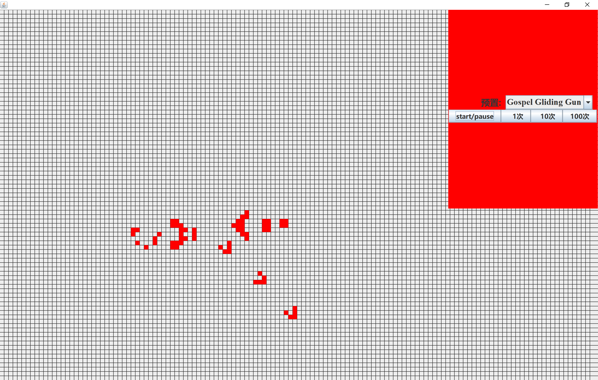

# Game of Life
A GUI application implementation of Conway's Game of Life.

# What is game of life

- [wiki Game of Life](https://en.wikipedia.org/wiki/Conway%27s_Game_of_Life)
- [Stephen Hawking's The Meaning of Life (John Conway's Game of Life segment)](https://curlie.org/Computers/Artificial_Life/Cellular_Automata/Conway%27s_Game_of_Life)
- [video showing](https://www.youtube.com/watch?v=C2vgICfQawE)

# Screenshot

# About

This is a practice code and there are still bugs about the problem of read threads being out of sync with write threads.

I will try to fix it(actually It had been fixed locally, sometimes It will be upload).

# Why is this game?

The charm of life games.

# Future

The issue of synchronization has been resolved, and the next problem to solve is how to make the interface click input valid(and mayde the interface can be more beautiful).